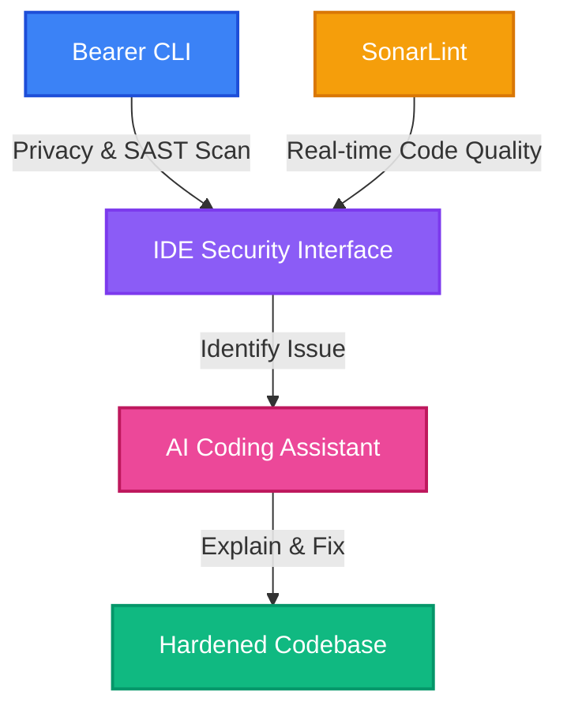
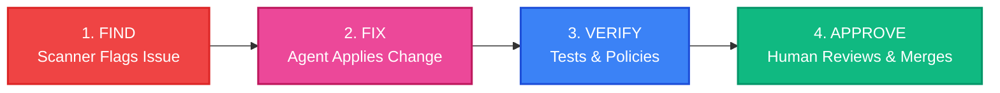

Here is the integrated DevSecOps guide with the numbering adjusted so the chapters begin at 1, keeping the flow and all SSDF compliance information perfectly intact.

---

# **DevSecOps Guide**

> **Core Objective:** A zero-license-cost DevSecOps pipeline for an on-premise Kubernetes data platform. Aligned with **NIST SSDF**, **OWASP DevSecOps guidance**, and **CIS hardening benchmarks**.

---

## **1. Executive Mandate & NIST SSDF Governance**

A pipeline cannot be compliant by technology alone; it requires organizational governance. This architecture is designed to fulfill the **NIST Secure Software Development Framework (SSDF - SP 800-218)**, which mandates outcomes across four core pillars:

1. **Prepare the Organization (PO):** People, processes, and policies are baseline prerequisites.
2. **Protect the Software (PS):** Code integrity is secured against tampering.
3. **Produce Well-Secured Software (PW):** Vulnerabilities are caught early via continuous integration testing.
4. **Respond to Vulnerabilities (RV):** Real-time monitoring and formalized incident response are actively maintained.

**Human & Policy Prerequisites:**
To satisfy SSDF Phase 1 (PO), the automated controls in this pipeline are backed by the following non-negotiable organizational rules:

* **Security Training:** All engineers must complete annual secure coding training (e.g., OWASP Top 10) prior to being granted CI/CD pipeline access.
* **Policy Enforcement:** Bypassing automated pipeline gates (e.g., Checkov, Kyverno) is explicitly prohibited unless accompanied by a documented, time-bound risk acceptance signed by a Security Lead.

---

## **2. Executive Strategy**

### **The Paradigm Shift**

This framework shifts security **left**, catching weaknesses during architectural design, coding, and containerization instead of waiting for production audits.

By utilizing highly targeted open-source utilities and community-tier tools rather than commercial suites, the primary investment shifts from recurring licensing fees to upfront operational engineering.

The architecture is governed end-to-end by the **OWASP Kubernetes Security Testing Guide (KSTG)**, which provides attacker-centric, Kubernetes-specific control objectives that each tool in this pipeline is selected to satisfy.

```mermaid
flowchart LR
    1[1. DESIGN<br/>Threat Dragon] --> 2[2. CODE<br/>SonarLint / Bearer]
    2 --> 3[3. PRE-COMMIT<br/>Checkov]
    3 --> 4[4. BUILD<br/>OWASP dep-scan]
    4 --> 5[5. GOVERN<br/>SecObserve]
    5 --> 6[6. DEPLOY<br/>Kyverno]
    6 --> 7[7. RUNTIME<br/>Falco]
    7 --> 8[8. AUDIT<br/>Kube-bench]
    8 --> 9[9. COMPLIANCE<br/>OpenSCAP]

    style 1 fill:#4B5563,stroke:#1F2937,stroke-width:2px,color:#fff
    style 2 fill:#3B82F6,stroke:#1D4ED8,stroke-width:2px,color:#fff
    style 3 fill:#F59E0B,stroke:#D97706,stroke-width:2px,color:#fff
    style 4 fill:#F97316,stroke:#C2410C,stroke-width:2px,color:#fff
    style 5 fill:#6366F1,stroke:#4338CA,stroke-width:2px,color:#fff
    style 6 fill:#10B981,stroke:#059669,stroke-width:2px,color:#fff
    style 7 fill:#EF4444,stroke:#DC2626,stroke-width:2px,color:#fff
    style 8 fill:#8B5CF6,stroke:#7C3AED,stroke-width:2px,color:#fff
    style 9 fill:#06B6D4,stroke:#0891B2,stroke-width:2px,color:#fff

```

### **High-Level Shift-Left Lifecycle**

| **Phase** | **Core Utility** | **Primary Responsibility** | **Strategic Value** |
| --- | --- | --- | --- |
| **1. Design** | Threat Dragon | Threat Modeling | Flushes out structural architectural design risks early. |
| **2. Code** | SonarLint & Bearer CLI | Local SAST & Privacy | Finds bugs and raw PII leakage directly inside the IDE. |
| **3. Pre-Commit** | Checkov | IaC Configuration Security | Blocks weak Helm charts and hardcoded secrets pre-merge. |
| **4. Build** | OWASP dep-scan | SCA & License Auditing | Evaluates application library risks prior to assembly. |
| **5. Govern** | SecObserve | Unified Vuln & License Mgmt | System of record for tracking security flaws and licenses. |
| **6. Deploy** | Kyverno | K8s Admission Control | Rejects non-compliant manifests at the API gate. |
| **7. Runtime** | Falco | Behavioral Detection | Flags real-time anomalies and container escapes. |
| **8. Audit** | Kube-bench | CIS Benchmarking | Validates underlying node hardening. |
| **9. Compliance** | OpenSCAP + STIG Viewer | Audit-ready reporting | Produces reports auditors already recognize. |

---

## **3. Supply Chain: Base Image Hardening**

The security baseline of the cluster rests heavily on the container layers you inherit, so the platform defaults to verified, stripped-down images rather than public hub distributions.

### **The Standard: dhi.io vs. Distroless**

* **dhi.io (Primary Runtimes):** For main application environments, stripping out package managers and shells, while tracking upstream patches on an automated cadence.
* **gcr.io/distroless (Static Binaries):** For self-contained compiled binaries (Go, Rust) that only need fundamental libraries such as glibc.

### **Hardening Architecture Matrix**

| **Capability** | **Standard Public Distributions** | **dhi.io Hardened (Free Tier)** | **dhi.io Hardened (Paid Enterprise)** |
| --- | --- | --- | --- |
| **Patch Velocity** | Occasional / quarterly | Weekly automated cycles | Daily / on-demand cycles |
| **Interim CVE Status** | Vulnerable between releases | Near-zero CVE footprint | Near-zero + contractual SLA |
| **Remediation SLA** | None | None (best-effort) | Guaranteed < 7 days |
| **Attack Surface** | High (ships with sh, apt, curl) | Zero (no shell, no utilities) | Zero + FIPS-grade crypto options |
| **Cryptographic Proofs** | Standard manifest | Signed SBOM & VEX metadata | Strict provenance + extended support |

---

## **4. Local Privacy & Security Scans**

To minimize friction in centralized pipelines, security starts at the developer workstation so issues are caught in seconds, before the first commit.

> **Source Code Integrity (SSDF PS.3):** Before any code reaches the CI/CD pipeline, the Git repository enforces strict branch protection rules. This includes mandatory cryptographic commit signatures and a strict two-person rule (approved PRs) to prevent unauthorized tampering.

### **Integrated Developer Toolset**

* **Bearer CLI (Privacy & Security):** Scans local code for logic bugs and PII leakage, such as sensitive data in logs, while keeping code on the developer machine.
* **SonarLint (Quality & Clean Code):** Acts as security “spellcheck” inside the IDE, catching common anti-patterns and vulnerabilities before builds.

### **AI-Assisted Developer Workflow (Code & Test)**

Pairing these scanners with coding agents turns security into a conversational workflow rather than a blocking gate.

* Instant triage: when a scanner flags a complex issue, the developer asks the agent to explain the attack vector in-context.
* Guided mitigation: the agent drafts fixes that satisfy scanner rules while preserving behavior, so only “clean” code reaches CI.

**Agent Boundaries at the Code Stage:** Agents may generate and refactor code and propose tests, but cannot push commits or merge branches; scanners and policies remain the source of security truth, and humans remain the source of intent and final approval.

---

## **5. Deep-Dive: Tool Profiles & Deployment Topology**

### **Tool Operational Profiles**

* **Checkov:** Parses IaC (Terraform, Helm, Kubernetes YAML) to stop misconfigured privileges or plain-text credentials from entering git history.
* **OWASP dep-scan:** Inspects open-source libraries for vulnerable dependencies and risky licenses before compilation.
* **SecObserve (Governance Hub):** Vulnerability and License Management system acting as the central orchestrator for findings and supply-chain risk.
* Ingests SBOMs and configuration reports.
* Supports triage, false-positive management, and license compliance tracking.
* Maintains a persistent remediation history as “Evidence of Control”.

* **Kyverno:** Kubernetes-native policy engine enforcing guardrails like non-root execution and image verification at admission time.
* **Falco:** Uses kernel-level instrumentation to monitor system calls and alert on suspicious runtime behavior.
* **Kube-bench:** Audits cluster configuration against CIS Kubernetes Benchmarks.
* **OpenSCAP:** Offline compliance and audit component for formalized evidence and standards-aligned reports.

### **Structural Component Placement**

> **Workstation Zone (Developer Laptop)** > Tools: SonarLint, Bearer CLI
> Objective: Shift-left validation of code and data flows before git pushes.

> **Pipeline Zone (CI/CD)** > Tools: Checkov, OWASP dep-scan
> Objective: Automated gatekeeping for infrastructure manifests and application libraries, with builds failing on high-severity issues.

> **Management Zone (Control Plane Infrastructure)** > Tools: SecObserve
> Objective: Central governance, deduplicating alerts and maintaining a tamper-resistant audit trail.

> **In-Cluster Zone (Live Kubernetes Environment)** > Tools: Kyverno, Falco, Kube-bench
> Objective: Active defense at admission and runtime, plus continuous node-hardening checks.

> **Compliance Overlay (Offline Auditing)** > Tools: OpenSCAP + STIG Viewer
> Objective: Audit readiness via standards-aligned reports from raw system evidence.

**Agent Boundaries in CI/CD and Review:** Agents can annotate builds and pull requests with comments and suggested fixes, but the pipeline never treats an agent review as equivalent to a human review; only human approvals unblock merges or deployments, and only humans trigger production rollouts or rollbacks.

---

## **6. Connecting the Controls: Tools to Evidence**

The platform must prove controls are effective, not just configured. This section ties each tool to the evidence it produces for auditors, all funneled into SecObserve.

| **Tool** | **Security Job** | **Evidence Produced** |
| --- | --- | --- |
| **Kube-bench / Checkov** | Configuration Check | Reports showing alignment with industry best practices. |
| **Kyverno** | Policy Enforcement | Logs showing rejected non-compliant resources (for example, root containers). |
| **Falco** | Live Monitoring | Streams of events flagging suspicious runtime behavior. |
| **Bearer / SonarLint** | Code Safety | Local scans demonstrating leaked secrets or weak code being fixed before deployment. |
| **OWASP dep-scan** | Supply Chain | SBOMs and vulnerability reports for third-party dependencies. |

### **SecObserve: The “Single Source of Truth”**

SecObserve aggregates scans, alerts, and remediations into a queryable history so teams can answer “How do you know your cluster is safe?” with evidence instead of opinions. As gaps are closed, their fixes are recorded as durable “Proof of Protection” entries that support broader frameworks such as NIST and CIS.

* **Incident Documentation (SSDF RV.3):** To fully close the loop on vulnerability response, any critical runtime event or exploited CVE tracked in SecObserve must have a formalized, blameless Root Cause Analysis (RCA) document attached before the ticket can be officially marked as resolved.

### **Known Security Gaps (The Roadmap)**

| **Risk Level** | **The Problem (Gap)** | **The Planned Fix** |
| --- | --- | --- |
| 🔴 **Critical** | Secrets exposure via plain-text storage | Introduce HashiCorp Vault for secure secret injection. |
| 🔴 **Critical** | Unverified container images | Use Cosign to sign and verify all images. |
| 🔴 **Critical** | Policy engine fragility | Deploy Kyverno in HA with backups. |
| 🟠 **High** | Lack of internal segmentation | Implement Kubernetes network policies (Cilium/Calico). |
| 🟠 **High** | Short log retention | Centralize logs in Loki/ELK with long-term storage. |

**Agent Boundaries in Operations & Maintenance:** In operations, agents are constrained to gathering and summarizing data (logs, metrics, alerts); humans own diagnosis and remediation decisions, while agents are granted more autonomy only in background maintenance tasks such as dependency updates that are fully covered by tests.

---

## **7. Agentic Orchestration: From Detection to Remediation**

> **Core Objective:** Evolve from a “security signaling” pipeline to an **assisted remediation** pipeline that compresses MTTR using on‑prem LLMs and agents, while preserving strict human-in-the-loop governance.

### **7.1 What “Agentic” Means Here**

In this platform, “agentic” means that AI agents continuously watch security signals from the pipeline and environment, propose changes in low-blast-radius areas (Code, Test, Maintain), and rely on humans to approve anything that affects risk, production state, or audit posture.

### **7.2 AI Agent Responsibility Model (DevSecOps Pipeline)**

AI agents are used across the pipeline, but humans retain control of risk decisions, production changes, and audit evidence.

| **Stage** | **Agent Security Role** | **Human Security Role** | **Guardrail** |
| --- | --- | --- | --- |
| **Plan** | Draft security requirements and threat-model checklists. | Approve scope and risk ratings. | Agents cannot accept risk or change severity. |
| **Design** | Suggest security patterns and mitigations. | Own data flows and trust boundaries. | Agents cannot approve architecture or reclassify data. |
| **Code** | Propose secure refactors and fixes for findings in branches. | Own intent and merge decisions. | Agents never push to protected branches or mark checks as passed. |
| **Test / Review** | Generate candidate security tests and first-pass PR comments. | Curate tests and perform final review. | Agents cannot merge tests or PRs; human approval is required. |
| **Deploy** | Enrich deploy checks with risk context. | Decide rollout and rollback. | Agents cannot trigger deploys or rollbacks. |
| **Runtime / Operate** | Correlate alerts and draft runbook steps. | Own incident severity, RCA, and containment. | Agents cannot close incidents or change on-call routing. |
| **Maintain** | Open PRs for low-risk dependency and policy updates. | Approve changes for critical systems. | Auto-fix limited to well-tested repos; humans approve merges. |

Agents are **never** allowed to initiate design changes, alter deployment pipelines, perform incident RCA, or trigger production deploys or rollbacks; those remain human-only responsibilities as defined in this DevSecOps Agent Responsibility Model.

### **7.3 Human–Agent Collaboration (Interactive Loop)**

On a day-to-day basis, agents act as “resident SRE/coders” working alongside developers and security engineers:

* When tools such as Bearer or SonarLint flag an issue, the agent explains the vulnerability in the local code context and suggests remediation options.
* The agent drafts candidate fixes and targeted tests; humans review, edit, and decide what actually lands in the branch.
* This keeps security work continuous and conversational while preserving human ownership of intent, design, and risk.

Interactive collaboration operates within the guardrails of the responsibility model: agents help investigate and propose, humans decide and approve.

### **7.4 Autonomous Agentic Loop (Low-Blast-Radius Work)**

For background maintenance and infrastructure debt, a constrained agent loop can handle routine tasks within the limits of the responsibility model:

This loop is explicitly limited to low-blast-radius tasks such as dependency bumps, static-analysis-driven refactors, and policy synthesis for Kyverno or Checkov, all validated by automated tests and admission policies before a human approves the merge.

### **7.5 Technical Pillars of Agentic Security**

| **Pillar** | **Mechanism** | **On-Premise Implementation** |
| --- | --- | --- |
| **1. Reachability Triage & Auto-Remediation** | Decide whether a CVE found by dep-scan is actually reachable and patch it if safe. | Agent analyzes call graphs, checks compatibility, updates dependencies, re-runs tests, and opens a PR with results and test outcomes attached. |
| **2. Policy Synthesis** | Convert plain-text NIST/CIS requirements into Kyverno or Checkov policies. | Agent translates rules like “must not run as root” into validated YAML policies, links them to test cases, and proposes them via PRs for human review. |

---

## **8. Acronyms & Abbreviations Reference**

| Acronym | Full Definition | Context in this Guide |
| --- | --- | --- |
| **API** | Application Programming Interface | The target gate where Kyverno intercepts and validates Kubernetes resource manifests. |
| **CI/CD** | Continuous Integration / Continuous Deployment | The automated pipeline zone where code is built, tested, and validated before production. |
| **CIS** | Center for Internet Security | The organization defining the global standard hardening benchmarks used by `kube-bench`. |
| **CLI** | Command Line Interface | Text-based interfaces used locally by developers (e.g., Bearer CLI) or within automated runners. |
| **CVE** | Common Vulnerabilities and Exposures | A publicly disclosed list of information security flaws tracked across base images and dependencies. |
| **DevSecOps** | Development, Security, and Operations | The practice of integrating automated security controls seamlessly throughout the entire software lifecycle. |
| **ELK** | Elasticsearch, Logstash, and Kibana | A common open-source stack used for centralized log aggregation and security event management. |
| **FIPS** | Federal Information Processing Standards | U.S. government computer security standards required for cryptographic modules in high-compliance zones. |
| **HA** | High Availability | Architectural setup (e.g., for Kyverno) ensuring the security system remains functional during a node failure. |
| **IaC** | Infrastructure as Code | Configuration files (Helm, Terraform, YAML) evaluated by `Checkov` for security flaws before deployment. |
| **IDE** | Integrated Development Environment | The local developer workspace where tools like `SonarLint` catch vulnerabilities in real time. |
| **K8s** | Kubernetes | The underlying container orchestration platform being secured and governed by this framework. |
| **KSTG** | Kubernetes Security Testing Guide | The OWASP framework providing attacker-centric control objectives specifically for Kubernetes. |
| **LLM** | Large Language Model | On-premise artificial intelligence models powering the assistant and autonomous remediation agents. |
| **MTTR** | Mean Time to Remediation | The average time required to identify, patch, and deploy a fix for a security vulnerability. |
| **NIST** | National Institute of Standards and Technology | The agency defining the Secure Software Development Framework (**SSDF**) governing this architecture. |
| **OWASP** | Open Worldwide Application Security Project | The global community providing baseline security frameworks for software code, dependencies, and Kubernetes. |
| **PII** | Personally Identifiable Information | Sensitive user data monitored by `Bearer CLI` to prevent accidental logging or exposure. |
| **PR** | Pull Request | The primary governance gate where humans review agent-generated or developer-submitted code changes. |
| **RCA** | Root Cause Analysis | The deep-dive investigation into how a runtime security incident or vulnerability occurred (owned strictly by humans). |
| **SAST** | Static Application Security Testing | The methodology used to scan raw source code for structural security vulnerabilities without executing it. |
| **SCA** | Software Composition Analysis | The practice of inspecting open-source third-party dependencies for known vulnerabilities and licensing risks. |
| **SBOM** | Software Bill of Materials | A structured inventory of all ingredients and dependencies nested within a hardened container image. |
| **SRE** | Site Reliability Engineering | The engineering discipline focused on keeping infrastructure scalable, highly available, and resilient. |
| **SSDF** | Secure Software Development Framework | NIST's standard set of core software development security practices baked into this strategy. |
| **STIG** | Security Technical Implementation Guide | Cybersecurity configuration standards set by DISA, verified using the OpenSCAP compliance overlay. |
| **VEX** | Vulnerability Exploitability eXchange | A companion metadata standard to SBOMs that clarifies whether a container image is *actually* vulnerable to a CVE. |
| **YAML** | YAML Ain't Markup Language | The human-readable data serialization language used to write Kubernetes manifests and Kyverno policies. |
