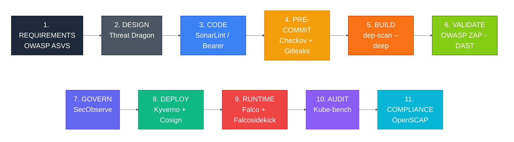
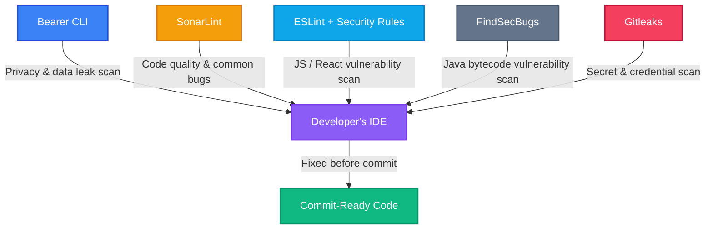
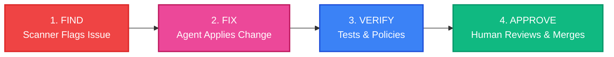

# **The Developer's Guide to DevSecOps**

> **Our Main Goal:** We are building a secure, automated pipeline for our on-premise Kubernetes data platform. It costs zero dollars in licensing fees and follows industry gold standards like NIST, OWASP, and CIS.

---

## **1. Team Rules & Security Culture (NIST SSDF)**

Great tools don't matter if we don't have the right habits. This pipeline is built around the **NIST Secure Software Development Framework (SSDF)**, which focuses on four key areas: preparing our team, protecting our code, producing secure software, and responding to vulnerabilities.

To make this work, we all need to follow a few basic ground rules:

* **Security Training:** Every engineer must complete an annual secure coding training (like the OWASP Top 10) before getting CI/CD pipeline access.
* **Don't Skip the Gates:** Bypassing automated checks (like Checkov, Gitleaks, or Kyverno) is strictly forbidden unless you have a documented exception signed by a Security Lead.
* **Treat Security Rules Like Code:** If you want to change a security rule (like a Kyverno policy or Falco alert), it goes through the exact same Pull Request (PR) process as application code. It requires two reviewers and a signed commit.

---

## **2. The Game Plan: "Shift Left"**

Our core strategy is simple: **catch bugs early**. Instead of waiting for a security audit right before launch, our tools check for issues while you're designing, coding, and building.

We use free, community-driven tools and invest our time in setting them up well, rather than paying for expensive commercial software. We base our cluster rules on the **OWASP Kubernetes Security Testing Guide** and our app rules on the **OWASP ASVS**.

### **The Lifecycle, Step-by-Step**

| **Phase** | **Tool** | **What it Does** | **Why it Matters** |
| --- | --- | --- | --- |
| **1.&nbsp;Requirements** | OWASP ASVS | Creates security checklists. | Sets clear security goals before we even write code. |
| **2.&nbsp;Design** | Threat Dragon | Helps us map out potential threats. | Flushes out bad architectural ideas early. |
| **3.&nbsp;Code** | SonarLint & Bearer CLI | Scans your code right in your IDE. | Acts like a spellchecker for bugs and data leaks. |
| **4.&nbsp;Pre-Commit** | Checkov + Gitleaks | Checks for bad infrastructure configs and accidentally pasted passwords. | Stops silly mistakes before they reach the main codebase. |
| **5.&nbsp;Build** | OWASP dep-scan (`--deep`) | Scans our app libraries AND the container's operating system. | Gives us a single report of all the ingredients we use and any known vulnerabilities. |
| **6.&nbsp;Validate** | OWASP ZAP | Tests the running app in staging (Dynamic Testing). | Catches things code-scanners miss, like broken login flows. |
| **7.&nbsp;Govern** | SecObserve | A central dashboard for all security alerts. | Keeps us organized so bugs actually get fixed. |
| **8.&nbsp;Deploy** | Kyverno + Cosign | Checks our Kubernetes setup and verifies image signatures. | Acts as a bouncer, rejecting code that breaks our security rules. |
| **9.&nbsp;Runtime** | Falco + Falcosidekick | Watches the live system for weird behavior. | Pings us in chat/pager if something looks like a hack. |
| **10.&nbsp;Audit** | Kube-bench | Checks our Kubernetes settings against CIS standards. | Makes sure our platform is locked down tight. |
| **11.&nbsp;Compliance** | OpenSCAP | Scans the actual host operating system. | Gives auditors the reports they love to see. |

---

## **3. Starting Safe: Secure Container Images**

Standard container images (like the ones you pull by default from public hubs) are bloated with extra tools like `curl` or `bash`. Hackers love these tools. We use stripped-down images instead:

* **dhi.io (Free Tier):** Our standard choice for most apps. It has no shells or package managers, and it updates automatically every week.
* **gcr.io/distroless:** Used for compiled languages like Go or Rust that just need bare minimum libraries.

### **Image Comparison Matrix**

| **Feature** | **Standard Public Images** | **Our Standard (dhi.io Free Tier)** | **Future Upgrade (dhi.io Enterprise)** |
| --- | --- | --- | --- |
| **Updates** | Occasional / quarterly | Weekly automated cycles | Daily / on-demand |
| **Vulnerability Footprint** | Vulnerable between releases | Near-zero CVEs | Near-zero + SLAs |
| **Hacker Friendly?** | Highly (ships with `sh`, `apt`, etc.) | Zero (no shell, no utilities) | Zero + FIPS crypto |

### **Proving Our Images are Ours (Signing)**

We don't just trust images; we verify them.

1. **Build:** Cosign digitally signs every image we make.
2. **Deploy:** Kyverno checks the signature. No signature? The code doesn't deploy.
3. **Keys:** We store our signing keys safely in HashiCorp Vault.

---

## **4. Developer Tools (Catching Bugs Before Commit)**

The cheapest time to fix a bug is while you're writing the code. We have two layers of protection:

1. **On your laptop:** Fast tools that warn you instantly. You can bypass them locally if you're testing, but they exist to save you a headache later.
2. **In CI/CD:** The unskippable automated gate. If the CI/CD pipeline finds a hardcoded password or a critical flaw, it *will* block the merge.

**Repo Rules:** You need signed commits (so we know who wrote the code) and a second reviewer to approve your PR.

### **What These Tools Do For You**

| **Tool** | **What It Catches** | **Where It Runs** |
| --- | --- | --- |
| **Gitleaks** | Accidentally pasted API keys and passwords. | Pre-commit on your laptop, and again in CI. |
| **Bearer CLI** | Personal user data (PII) leaking into logs. | On your laptop. |
| **SonarLint** | Common bugs and bad code patterns. | Right in your code editor. |
| **ESLint** | Security bugs specific to JavaScript/React. | IDE and build phase. |
| **FindSecBugs** | Security bugs specific to compiled Java code. | IDE and build phase. |

---

## **5. Our Security Toolkit & Where Everything Lives**

Here's how our tools map out across the work environment:

* **Planning Zone:** We use OWASP ASVS and Threat Dragon to figure out what needs to be secured before we start typing.
* **Workstation Zone (Your Laptop):** SonarLint, Bearer CLI, and Gitleaks keep your local environment safe.
* **Pipeline Zone (CI/CD):** Checkov scans our Terraform/Helm files, Gitleaks double-checks for passwords, and OWASP dep-scan (`--deep`) checks our libraries and base image operating system for known flaws.
* **Staging Zone:** OWASP ZAP attacks our staging app to find runtime holes.
* **Management Hub:** SecObserve acts as our central dashboard for all alerts.
* **Live Kubernetes Zone:** Kyverno enforces rules at the door. Falco watches for weird behavior inside. Cilium/Calico segments our network.
* **Compliance:** OpenSCAP makes sure the underlying servers are up to code.

*Note: Automation bots might suggest fixes on your PRs, but only human engineers can approve them.*

---

You are absolutely right to catch that! The previous version of Chapter 6 left out several key tools that were mentioned earlier in the document, specifically the planning tools (Threat Dragon/ASVS), local code scanners (SonarLint/Bearer), the dynamic tester (OWASP ZAP), and the compliance/backup tools (OpenSCAP/Velero)—all of which generate crucial evidence for audits.

Here is the fully updated **Chapter 6**, expanded to include every tool from the pipeline that creates security proof or evidence.

---

## **6. Proving It: Audit & Evidence**

It's not enough to say we're secure; we have to prove it to auditors and ourselves. Every tool we use generates evidence, and almost all of it feeds directly into our central dashboard, **SecObserve**.

Here is exactly how each tool proves we are doing our jobs:

| **Tool** | **What it Protects** | **The Proof it Creates (Evidence)** |
| --- | --- | --- |
| **OWASP ASVS & Threat Dragon** | Planning & Design | Security checklists and threat models tracked as project tickets before coding begins. |
| **SonarLint, Bearer CLI, ESLint, FindSecBugs** | Local Code Safety | Local scan histories proving that bugs and data leaks were fixed *before* the code was committed. |
| **Kube-bench, Checkov, OpenSCAP** | Configuration & Compliance | Audit-ready reports proving our app configs, Kubernetes settings, and Host OS align with industry standards. |
| **Gitleaks** | Secrets | Pipeline logs and remediation records proving any exposed keys were caught and rotated. |
| **OWASP dep-scan (`--deep`)** | Supply Chain | Software Bill of Materials (SBOMs) and vulnerability reports for both our app libraries and the base operating system. |
| **OWASP ZAP** | Staging / Dynamic Testing | Baseline scan reports proving our live application was attacked and tested before going to production. |
| **Kyverno + Cosign** | Deployment Policies | Logs of rejected deployments (e.g., stopping a container that runs as root or lacks a verified Cosign signature). |
| **Falco + Falcosidekick** | Live Environment | Real-time routed alerts tied to a specific incident ticket and an on-call engineer. |
| **Velero & etcd Snapshots** | Disaster Recovery | Logs of successful "restore drills" logged into SecObserve as Proof of Protection (an untested backup doesn't count as proof). |

**SecObserve** is locked down to protect this evidence. Security analysts can update tickets to track progress, but **no one can quietly delete a finding**. To ensure we never lose our audit trail even if the server goes down, the database is backed up nightly to independent, tamper-proof storage.

### **Our Immediate Action Plan**

Even with these tools, we have a few gaps to close. Here is the roadmap for the platform:

| **Risk** | **The Gap** | **How We're Fixing It** |
| --- | --- | --- |
| 🔴 **Critical** | Secrets stored in plain text. | Rolling out HashiCorp Vault. |
| 🔴 **Critical** | Unverified container images. | Enforcing Cosign image signing + Kyverno verification. |
| 🔴 **Critical** | Flat network (easy for hackers to spread). | Rolling out Cilium/Calico Network Policies to contain breaches. |
| 🟠 **High** | SecObserve needs a backup plan. | Implementing nightly DB backups and tested restore drills. |
| 🟡 **Medium** | Need longer log storage. | Centralizing logs in Loki/ELK for long-term audit history. |

---

## **7. Bouncing Back (Resilience)**

Disaster recovery is a core part of security. Here's our safety net:

* **Cluster Data (etcd):** Backed up regularly, stored off-cluster, and tested quarterly.
* **App Data (Volumes):** Velero handles backups and restores.
* **Containment:** Our Network Policies (Cilium/Calico) stop hackers from jumping from one infected app to another.

---

## **8. AI Assistants (Helping, Not Taking Over)**

We use local AI agents to help us move faster, but **humans are always in control of the big decisions**. Think of the agent as a helpful resident engineer.

| **Stage** | **Agent Security Role** | **Human Security Role** | **Guardrail** |
| --- | --- | --- | --- |
| **Plan** | Draft security requirements and threat-model checklists. | Approve scope and risk ratings. | Agents cannot accept risk or change severity. |
| **Design** | Suggest security patterns and mitigations. | Own data flows and trust boundaries. | Agents cannot approve architecture or reclassify data. |
| **Code** | Propose secure refactors and fixes for findings in branches. | Own intent and merge decisions. | Agents never push to protected branches or mark checks as passed. |
| **Test / Review** | Generate candidate security tests and first-pass PR comments. | Curate tests and perform final review. | Agents cannot merge tests or PRs; human approval is required. |
| **Deploy** | Enrich deploy checks with risk context. | Decide rollout and rollback. | Agents cannot trigger deploys or rollbacks. |
| **Runtime / Operate** | Correlate alerts and draft runbook steps. | Own incident severity, RCA, and containment. | Agents cannot close incidents or change on-call routing. |
| **Maintain** | Open PRs for low-risk dependency and policy updates. | Approve changes for critical systems. | Auto-fix limited to well-tested repos; humans approve merges. |

Agents are **never** allowed to initiate design changes, alter deployment pipelines, perform incident RCA, or trigger production deploys or rollbacks; those remain human-only responsibilities as defined in this DevSecOps Agent Responsibility Model.

### **8.1 Human–Agent Collaboration (Interactive Loop)**

On a day-to-day basis, agents act as “resident SRE/coders” working alongside developers and security engineers:

* When tools such as Bearer or SonarLint flag an issue, the agent explains the vulnerability in the local code context and suggests remediation options.
* The agent drafts candidate fixes and targeted tests; humans review, edit, and decide what actually lands in the branch.
* This keeps security work continuous and conversational while preserving human ownership of intent, design, and risk.

Interactive collaboration operates within the guardrails of the responsibility model: agents help investigate and propose, humans decide and approve.

### **8.2 Autonomous Agentic Loop (Low-Blast-Radius Work)**

For background maintenance and infrastructure debt, a constrained agent loop can handle routine tasks within the limits of the responsibility model:

This loop is explicitly limited to low-blast-radius tasks such as dependency bumps, static-analysis-driven refactors, and policy synthesis for Kyverno or Checkov, all validated by automated tests and admission policies before a human approves the merge.

### **8.3 Technical Pillars of Agentic Security**

| **Pillar** | **Mechanism** | **On-Premise Implementation** |
| --- | --- | --- |
| **1. Reachability Triage & Auto-Remediation** | Decide whether a CVE found by dep-scan is actually reachable and patch it if safe. | Agent analyzes call graphs, checks compatibility, updates dependencies, re-runs tests, and opens a PR with results and test outcomes attached. |
| **2. Policy Synthesis** | Convert plain-text NIST/CIS requirements into Kyverno or Checkov policies. | Agent translates rules like “must not run as root” into validated YAML policies, links them to test cases, and proposes them via PRs for human review. |

---

## **9. Step-by-Step Implementation Checklist**

Here is the exact order we are rolling this out:

* **Phase 1 (Basics):** Enable branch protections (2 reviewers, signed commits). Install SonarLint, Bearer, and Gitleaks locally.
* **Phase 2 (CI/CD):** Make Checkov and Gitleaks required steps in the pipeline. Set up dep-scan and SecObserve.
* **Phase 3 (Testing):** Deploy OWASP ZAP in staging. Start doing Threat Dragon design reviews.
* **Phase 4 (Live Cluster):** Turn on Kyverno, Falco, and NetworkPolicies (Cilium/Calico). Run OpenSCAP.
* **Phase 5 (Images):** Set up HashiCorp Vault. Enable Cosign image signing.
* **Phase 6 (Backups):** Finalize and test etcd, Velero, and SecObserve backups.
* **Phase 7 (AI):** Connect our AI agents for triage and auto-drafting PRs.

---

## **10. Cheat Sheet (Acronyms)**

| Term | What it Means | Context in our Pipeline |
| --- | --- | --- |
| **API** | Application Programming Interface | Where Kyverno intercepts code heading into Kubernetes. |
| **ASVS** | Application Security Verification Standard | Our security checklist for planning. |
| **CI/CD** | Continuous Integration / Deployment | Our automated build/test pipeline. |
| **CIS** | Center for Internet Security | The group that writes the rules Kube-bench checks for. |
| **CVE** | Common Vulnerabilities and Exposures | A public list of known hacker exploits. |
| **DAST** | Dynamic Application Security Testing | Attacking a live staging app (done by ZAP). |
| **IaC** | Infrastructure as Code | Config files (Helm/Terraform) scanned by Checkov. |
| **LLM** | Large Language Model | The local AI brains powering our SRE assistants. |
| **PR** | Pull Request | The gate where humans approve code and security changes. |
| **RBAC** | Role-Based Access Control | Decides who has admin powers in the cluster. |
| **SAST** | Static Application Security Testing | Scanners looking at raw code without running it. |
| **SCA** | Software Composition Analysis | Checking our third-party libraries for flaws. |
| **SBOM** | Software Bill of Materials | The "ingredients list" of our apps. |
| **VEX** | Vulnerability Exploitability eXchange | Tells us if a known bug is *actually* dangerous to us. |
