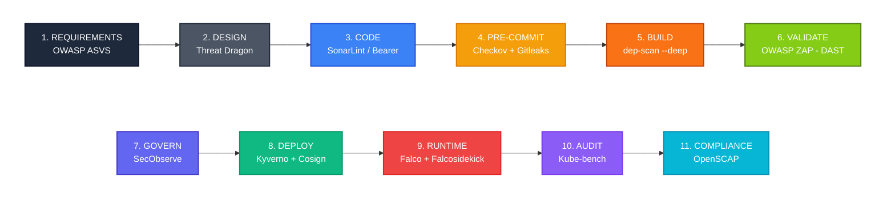
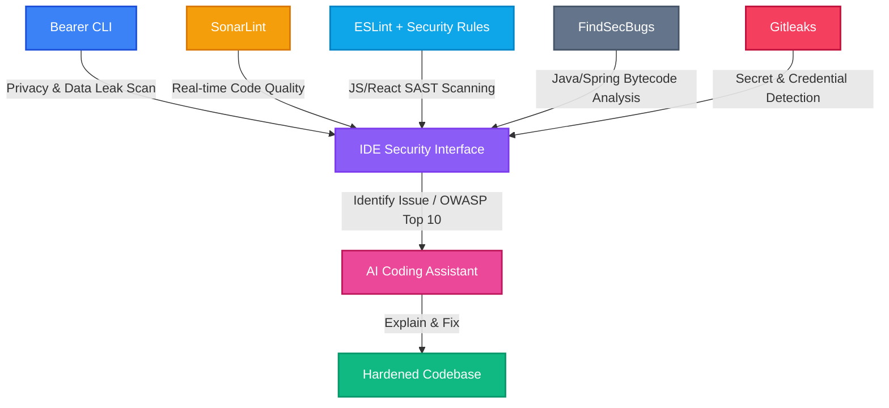
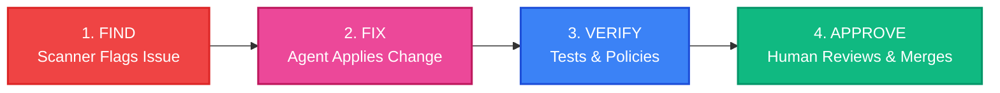

# **DevSecOps Guide**

> **Core Objective:** A zero-license-cost DevSecOps pipeline for an on-premise Kubernetes data platform. Aligned with **NIST SSDF**, **OWASP DevSecOps guidance**, and **CIS hardening benchmarks**.
>

---

## **1. Executive Mandate & NIST SSDF Governance**

A pipeline cannot be compliant by technology alone; it requires organizational governance. This architecture is designed to fulfill the **NIST Secure Software Development Framework (SSDF - SP 800-218)**, which mandates outcomes across four core pillars:

1. **Prepare the Organization (PO):** People, processes, and policies are baseline prerequisites.
2. **Protect the Software (PS):** Code and security-policy configuration are secured against tampering, end to end.
3. **Produce Well-Secured Software (PW):** Security is designed in (threat modeling), built in (secure coding), and verified continuously (SAST, SCA, DAST, IaC scanning) rather than caught only at a single CI gate.
4. **Respond to Vulnerabilities (RV):** Real-time monitoring, formalized incident response, and tested recovery procedures are actively maintained.

**Human & Policy Prerequisites:**
To satisfy SSDF Phase 1 (PO), the automated controls in this pipeline are backed by the following non-negotiable organizational rules:

* **Security Training:** All engineers must complete annual secure coding training (e.g., OWASP Top 10) prior to being granted CI/CD pipeline access.
* **Policy Enforcement:** Bypassing automated pipeline gates (e.g., Checkov, Gitleaks, Kyverno) is explicitly prohibited unless accompanied by a documented, time-bound risk acceptance signed by a Security Lead.
* **Policy-as-Code Change Control (NEW):** Changes to the security controls themselves — Kyverno `ClusterPolicy` manifests, Falco rule files, Checkov custom checks — are governed by the *same* two-person review and signed-commit rule defined for application code in Section 4. A scanner is not a security boundary if anyone can quietly edit its rules; the rule repositories are protected branches like any other.

---

## **2. Executive Strategy**

### **The Paradigm Shift**

This framework shifts security **left**, catching weaknesses during architectural design, coding, and containerization instead of waiting for production audits.

By utilizing highly targeted open-source utilities and community-tier tools rather than commercial suites, the primary investment shifts from recurring licensing fees to upfront operational engineering.

The architecture is directionally governed by the **OWASP Kubernetes Security Testing Guide (KSTG)** for cluster infrastructure, and the **OWASP Application Security Verification Standard (ASVS)** for application-layer requirements. *Note: KSTG is an actively evolving OWASP project, not yet a finished, versioned standard like ASVS — it is treated here as the best available attacker-centric reference for cluster testing, and is supplemented by CIS Kubernetes Benchmarks (via kube-bench) wherever KSTG coverage is incomplete.*

### **High-Level Shift-Left Lifecycle**

| **Phase** | **Core Utility** | **Primary Responsibility** | **Strategic Value** |
| --- | --- | --- | --- |
| **1. Requirements** | OWASP ASVS | Security User Stories | Establishes testable security acceptance criteria before design or code. |
| **2. Design** | Threat Dragon | Threat Modeling | Flushes out structural architectural design risks early; outputs feed the backlog (see Section 5). |
| **3. Code** | SonarLint & Bearer CLI | Local SAST & Privacy | Finds bugs and raw PII leakage directly inside the IDE. |
| **4. Pre-Commit** | Checkov + Gitleaks | IaC Configuration & Secrets Detection | Blocks weak Helm charts, hardcoded secrets, and high-entropy credential strings pre-merge. Re-run (non-bypassable) in CI. |
| **5. Build** | OWASP dep-scan (`--deep`) | SCA + Container/OS Vulnerability Scanning | A single free tool scans both **application libraries** and the **built container's OS packages**, producing one SBOM + VEX/VDR pair instead of two disconnected reports. |
| **6. Validate** | OWASP ZAP (Baseline Scan) | Dynamic Application Security Testing (DAST) | Exercises the running app in staging for issues static analysis structurally cannot see (auth flows, session handling, live config). |
| **7. Govern** | SecObserve | Unified Vuln & License Mgmt | System of record for tracking security flaws, licenses, and policy exceptions. |
| **8. Deploy** | Kyverno + Cosign | K8s Admission Control + Image Signature Verification | Rejects non-compliant manifests at the API gate; verifies image signatures once Cosign signing is live (see Section 3). |
| **9. Runtime** | Falco + Falcosidekick | Behavioral Detection & Alert Routing | Flags real-time anomalies and container escapes, and routes them to a named destination (chat/pager/SecObserve) instead of an unread log. |
| **10. Audit** | Kube-bench | CIS Benchmarking | Validates K8s control-plane and kubelet hardening. |
| **11. Compliance** | OpenSCAP + STIG Viewer | Audit-ready reporting | Validates underlying **host OS** hardening and produces reports auditors already recognize. *(Scope note: kube-bench checks Kubernetes components; OpenSCAP checks the OS beneath them — complementary, not redundant.)* |

---

## **3. Supply Chain: Base Image Hardening**

The security baseline of the cluster rests heavily on the container layers you inherit, so the platform defaults to verified, stripped-down images rather than public hub distributions.

### **The Standard: dhi.io vs. Distroless**

* **dhi.io (Primary Runtimes):** For main application environments, stripping out package managers and shells, while tracking upstream patches on an automated cadence.
* **gcr.io/distroless (Static Binaries):** For self-contained compiled binaries (Go, Rust) that only need fundamental libraries such as glibc.

> **Tier clarification (NEW):** This architecture standardizes on the **dhi.io Free / Community tier**, which requires only a free Docker account to authenticate and pull. The Enterprise-tier row below is retained for forward-planning reference only — it is **not** currently licensed, and adopting it would be a deliberate, budgeted decision, not an automatic upgrade.

### **Hardening Architecture Matrix**

| **Capability** | **Standard Public Distributions** | **dhi.io Hardened (Free Tier — in use)** | **dhi.io Hardened (Paid Enterprise — reference only)** |
| --- | --- | --- | --- |
| **Patch Velocity** | Occasional / quarterly | Weekly automated cycles | Daily / on-demand cycles |
| **Interim CVE Status** | Vulnerable between releases | Near-zero CVE footprint | Near-zero + contractual SLA |
| **Remediation SLA** | None | None (best-effort) | Guaranteed < 7 days |
| **Attack Surface** | High (ships with sh, apt, curl) | Zero (no shell, no utilities) | Zero + FIPS-grade crypto options |
| **Cryptographic Proofs** | Standard manifest | Signed SBOM & VEX metadata | Strict provenance + extended support |

### **Image Signing & Verification Roadmap**

| State | What's Actually True |
| --- | --- |
| **Today** | Kyverno enforces *configuration* policy (non-root, no privilege escalation, resource limits, Pod Security Admission profile). It does **not** verify image signatures, because no signatures are being produced yet. |
| **Target** | Cosign signs every image at Build. Kyverno's `verifyImages` policy rejects any image at admission that lacks a valid signature from the trusted key. |
| **On-prem key management decision (must be made before rollout)** | Sigstore's default *keyless* signing flow depends on the public Fulcio/Rekor infrastructure — this will not work in an air-gapped on-prem cluster. Choose one: (a) a self-hosted private Sigstore stack (Fulcio + Rekor + a private CA), or (b) long-lived Cosign keys held in **HashiCorp Vault** (already on the roadmap below) as the signing backend. Option (b) is simpler to stand up first and reuses infrastructure you're already building. |

---

## **4. Local Privacy & Security Scans**

To minimize friction in centralized pipelines, security starts at the developer workstation so issues are caught in seconds, before the first commit.

> **Source Code Integrity (SSDF PS.3):** Before any code reaches the CI/CD pipeline, the Git repository enforces strict branch protection rules: **mandatory cryptographic commit signatures** (verified via the VCS's "require signed commits" branch protection setting), **required status checks** (CI re-runs of every local gate), and a **strict two-person rule** enforced via CODEOWNERS + required PR approvals. This same protection extends to the policy-as-code repositories (Kyverno, Falco, Checkov rules) per Section 1.

> **Local gates are fast feedback, not the security boundary (NEW):** A developer can bypass a local pre-commit hook with `git commit --no-verify`. That's fine — it's a convenience layer. The actual enforcement boundary is the **CI re-run** of Checkov and Gitleaks against every pushed commit and every PR, which cannot be skipped by an individual developer. The org policy in Section 1 (no bypassing gates without signed risk acceptance) governs the CI gate, not the local one.

### **Integrated Developer Toolset**

* **Gitleaks (Secrets Detection — NEW):** Scans staged changes and full git history for hardcoded credentials, API keys, and high-entropy strings. Runs as a pre-commit hook locally and as a non-bypassable CI gate on every push. A one-time historical scan of existing repository history is required before this control can be trusted as complete — secrets committed before today don't disappear because a new hook was added.
* **Bearer CLI (Privacy & Security):** Scans local code for logic bugs and PII leakage, such as sensitive data in logs, while keeping code on the developer machine.
* **SonarLint (Quality & Clean Code):** Acts as security "spellcheck" inside the IDE, catching common anti-patterns and vulnerabilities before builds.
* **ESLint Security Configurations (Frontend SAST):** Leverages Abstract Syntax Tree (AST) parsing on client-side React and JavaScript code. It explicitly targets context-aware vulnerabilities like Prototype Pollution, Regular Expression Denial of Service (ReDoS), and Cross-Site Scripting (XSS) by strictly enforcing the "Validate Input, Encode/Escape Output" standard.
* **FindSecBugs / SpotBugs (Backend SAST):** Performs deep data-flow (taint) analysis on compiled Java bytecode. It tracks untrusted inputs from boundary layers (Spring Boot API controllers) down to structural components to automatically catch critical OWASP Top 10 risks like SQL Injection, Path Traversal, and Cryptographic weaknesses before binary packaging.

### **AI-Assisted Developer Workflow (Code & Test)**

Pairing these ecosystem-specific scanners with coding agents turns security into a conversational workflow rather than a blocking gate.

* **Instant triage:** When a linter or bytecode analyzer flags a complex OWASP Top 10 issue, the developer asks the agent to explain the specific data-flow or attack vector in-context.
* **Guided mitigation:** The agent drafts structural fixes that satisfy linter and security rules while preserving core application behavior, ensuring only structurally sound and "clean" code reaches CI.

**Agent Boundaries at the Code Stage:** Agents may generate and refactor code and propose tests, but cannot push commits or merge branches; scanners and policies remain the source of security truth, and humans remain the source of intent and final approval. See Section 8.6 for how agents must treat scanner output and other automated inputs.

---

## **5. Deep-Dive: Tool Profiles & Deployment Topology**

### **Tool Operational Profiles**

* **OWASP ASVS:** Provides a checklist framework matrix used to build verifiable functional security controls directly into project acceptance criteria.
* **Checkov:** Parses IaC (Terraform, Helm, Kubernetes YAML) to stop misconfigured privileges or risky settings from entering git history. The CI run (not the local hook) is the authoritative gate.
* **Gitleaks:** Dedicated secrets-detection scanner, distinct from Checkov's IaC focus. Covers staged diffs, full history, and CI pushes.
* **OWASP dep-scan:** Run in standard mode against the source tree, it performs **SCA** — inspecting open-source libraries for vulnerable dependencies and risky licenses. Run with the `--deep` flag against the **built container image**, it additionally generates an OS-package SBOM and checks it for CVEs — covering the job a tool like Trivy or Grype would otherwise be needed for. One tool, one SBOM/VEX pipeline, one place to govern: SecObserve.
* **OWASP ZAP (Baseline Scan):** Free, open-source DAST tool. Run against a staging deployment before promotion, it tests the live application for issues that are invisible to static analysis — broken auth flows, session handling, security headers, live configuration drift.
* **SecObserve (Governance Hub):** Vulnerability and License Management system acting as the central orchestrator for findings and supply-chain risk.
  * Ingests SBOMs (application-layer from standard dep-scan runs, OS-layer from `--deep` runs) and configuration/DAST reports.
  * Supports triage, false-positive management, and license compliance tracking.
  * Maintains a persistent remediation history as "Evidence of Control" — see Section 6 for how tamper-resistance is actually implemented, not just claimed.
* **Kyverno:** Kubernetes-native policy engine enforcing guardrails like non-root execution, resource limits, and Pod Security Admission baseline/restricted profiles at admission time. Image *signature* verification activates once Cosign is live (Section 3) — until then, this is a configuration gate, not a supply-chain integrity gate.
* **Falco + Falcosidekick:** Falco uses kernel-level instrumentation to monitor system calls and alert on suspicious runtime behavior. Falcosidekick (the free companion project) routes those alerts to a **named destination** — chat, pager, and SecObserve — so detections become incidents, not unread log lines.
* **Kube-bench:** Audits Kubernetes control-plane and kubelet configuration against CIS Kubernetes Benchmarks.
* **OpenSCAP:** Offline compliance and audit component for formalized evidence and standards-aligned reports against the **host OS** layer beneath Kubernetes.

### **Structural Component Placement**

> **Planning / Design Zone (Product Management / JIRA — expanded)**
> Tools: OWASP ASVS, Threat Dragon
> Objective: Proactive definition of functional security baselines and threat models before project engineering kicks off. *(Fixed in v2: Threat Dragon's output — identified threats and mitigations — is filed as tracked backlog items and mirrored into SecObserve, not left as a static diagram nobody revisits.)*

> **Workstation Zone (Developer Laptop)**
> Tools: SonarLint, Bearer CLI, Gitleaks (local hook)
> Objective: Shift-left validation of code, secrets, and data flows before git pushes.

> **Pipeline Zone (CI/CD)**
> Tools: Checkov, Gitleaks (authoritative re-run), OWASP dep-scan (`--deep` for image/OS coverage)
> Objective: Automated gatekeeping for infrastructure manifests, secrets, application libraries, and container/OS packages, with builds failing on high-severity issues.

> **Validate Zone (Staging — NEW)**
> Tools: OWASP ZAP
> Objective: Dynamic testing of the running application before promotion to production; closes the gap where static-only analysis can't confirm ASVS runtime requirements.

> **Management Zone (Control Plane Infrastructure)**
> Tools: SecObserve
> Objective: Central governance, deduplicating alerts and maintaining an audit trail with explicit RBAC and backup guarantees (Section 6 and 7).

> **In-Cluster Zone (Live Kubernetes Environment — expanded)**
> Tools: Kyverno (+ Pod Security Admission profiles, resource quotas), Falco + Falcosidekick, Kube-bench, NetworkPolicies (Cilium/Calico)
> Objective: Active defense at admission and runtime, continuous node-hardening checks, and — critically — **network segmentation**, without which Falco can only observe lateral movement, not stop it.

> **Compliance Overlay (Offline Auditing)**
> Tools: OpenSCAP + STIG Viewer
> Objective: Audit readiness via standards-aligned reports from raw host-OS evidence.

**Agent Boundaries in CI/CD and Review:** Agents can annotate builds and pull requests with comments and suggested fixes, but the pipeline never treats an agent review as equivalent to a human review; only human approvals unblock merges or deployments, and only humans trigger production rollouts or rollbacks.

---

## **6. Connecting the Controls: Tools to Evidence**

The platform must prove controls are effective, not just configured. This section ties each tool to the evidence it produces for auditors, all funneled into SecObserve.

| **Tool** | **Security Job** | **Evidence Produced** |
| --- | --- | --- |
| **Kube-bench / Checkov** | Configuration Check | Reports showing alignment with industry best practices. |
| **Gitleaks** | Secrets Detection | Pre-commit/CI scan logs; one-time historical repo scan report; remediation record for any found-and-rotated credential. |
| **Kyverno** | Policy Enforcement | Logs showing rejected non-compliant resources (root containers, missing resource limits, unsigned images once Cosign is live). |
| **Falco / Falcosidekick** | Live Monitoring | Streams of routed events flagging suspicious runtime behavior, with a recorded destination and on-call owner. |
| **Bearer / SonarLint** | Code Safety | Local scans demonstrating leaked secrets or weak code being fixed before deployment. |
| **OWASP dep-scan** | Supply Chain — App + Container/OS | SBOM and VEX/VDR reports for third-party libraries **and** the OS packages in the built image, from a single tool run. |
| **OWASP ZAP** | Dynamic Testing | Baseline scan reports against staging, tracked alongside static findings in SecObserve. |

### **SecObserve: The "Single Source of Truth"**

SecObserve aggregates scans, alerts, and remediations into a queryable history so teams can answer "How do you know your cluster is safe?" with evidence instead of opinions. As gaps are closed, their fixes are recorded as durable "Proof of Protection" entries that support broader frameworks such as NIST and CIS.

> **What "tamper-resistant" actually means here:**
> * Analysts can update finding status (triaged, false-positive, accepted-risk) but cannot hard-delete a finding — deletion is disabled at the RBAC layer.
> * Every status change is itself an audit-logged event with actor, timestamp, and justification.
> * A nightly export of the SecObserve database is written to immutable/append-only storage, independent of the live instance, so the audit trail survives even a compromise of the SecObserve host itself.

* **Incident Documentation (SSDF RV.3 — scope expanded):** To fully close the loop on vulnerability response, any critical runtime event, exploited CVE, **or confirmed policy bypass** tracked in SecObserve must have a formalized, blameless Root Cause Analysis (RCA) document attached before the ticket can be officially marked as resolved.

### **Remaining / Re-Prioritized Roadmap**

| **Risk Level** | **The Problem (Gap)** | **The Planned Fix** |
| --- | --- | --- |
| 🔴 **Critical** | Secrets exposure via plain-text storage | Introduce HashiCorp Vault for secure secret injection. |
| 🔴 **Critical** | Unverified container images | Cosign signing + Kyverno `verifyImages`, keyed via Vault or a private Sigstore stack (Section 3). |
| 🔴 **Critical** | Policy engine fragility | Deploy Kyverno in HA with backups. |
| 🔴 **Critical**  | Lack of internal network segmentation | Implement Kubernetes NetworkPolicies (Cilium/Calico). Without this, Falco detects lateral movement but cannot contain it — see Section 7. |
| 🟠 **High** | No backup/HA for SecObserve itself, the system of record for all evidence above | Nightly DB backup + documented, tested restore procedure (Section 7). |
| 🟠 **High** | No policy-as-code RBAC formalization beyond the stated rule | Enforce branch protection technically (not just by policy) on Kyverno/Falco/Checkov rule repos, identical to app-code branch protection. |
| 🟡 **Medium** | Short log retention | Centralize logs in Loki/ELK with long-term storage. |
| 🟡 **Medium** | No Pod Security Admission baseline/restricted enforcement or resource quotas beyond Kyverno's non-root check | Roll out PSA profiles + namespace ResourceQuotas cluster-wide. |

**Agent Boundaries in Operations & Maintenance:** In operations, agents are constrained to gathering and summarizing data (logs, metrics, alerts); humans own diagnosis and remediation decisions, while agents are granted more autonomy only in background maintenance tasks such as dependency updates that are fully covered by tests.

---

## **7. Resilience & Disaster Recovery (NEW SECTION)**

* **etcd backup:** Scheduled, encrypted etcd snapshots, stored off-cluster. Restore procedure documented and **drilled on a fixed cadence** (e.g., quarterly) — an untested backup is a hypothesis, not a control.
* **Persistent volume / data backup:** **Velero** (free, CNCF, consistent with the zero-license-cost mandate) for namespace- and PV-level backup/restore, with the same drill cadence as etcd.
* **SecObserve resilience:** Nightly database backup, independent storage location, documented restore runbook (ties to the High-priority gap in Section 6).
* **Network segmentation as containment, not just hygiene:** NetworkPolicies (Cilium/Calico) are reframed here as a **recovery-time control**: in a flat network, a single compromised pod has unrestricted east-west reach, which is exactly the scenario Falco is built to detect but not stop. This is why the gap is rated Critical, not High.
* **Restore drills are evidence too:** Each successful drill (etcd, PV, SecObserve) is logged as a "Proof of Protection" entry in SecObserve, the same way a closed CVE is — auditors increasingly ask "when did you last *test* your backup," not just "do you have one."

---

## **8. Agentic Orchestration: From Detection to Remediation**

> **Core Objective:** Evolve from a "security signaling" pipeline to an **assisted remediation** pipeline that compresses MTTR using on‑prem LLMs and agents, while preserving strict human-in-the-loop governance.

### **8.1 What "Agentic" Means Here**

In this platform, "agentic" means that AI agents continuously watch security signals from the pipeline and environment, propose changes in low-blast-radius areas (Code, Test, Maintain), and rely on humans to approve anything that affects risk, production state, or audit posture.

### **8.2 AI Agent Responsibility Model (DevSecOps Pipeline)**

AI agents are used across the pipeline, but humans retain control of risk decisions, production changes, and audit evidence.

| **Stage** | **Agent Security Role** | **Human Security Role** | **Guardrail** |
| --- | --- | --- | --- |
| **Plan** | Draft security requirements and threat-model checklists. | Approve scope and risk ratings. | Agents cannot accept risk or change severity. |
| **Design** | Suggest security patterns and mitigations. | Own data flows and trust boundaries. | Agents cannot approve architecture or reclassify data. |
| **Code** | Propose secure refactors and fixes for findings in branches. | Own intent and merge decisions. | Agents never push to protected branches or mark checks as passed. |
| **Test / Review** | Generate candidate security tests and first-pass PR comments. | Curate tests and perform final review. | Agents cannot merge tests or PRs; human approval is required. |
| **Deploy** | Enrich deploy checks with risk context. | Decide rollout and rollback. | Agents cannot trigger deploys or rollbacks. |
| **Runtime / Operate** | Correlate alerts and draft runbook steps. | Own incident severity, RCA, and containment. | Agents cannot close incidents or change on-call routing. |
| **Maintain** | Open PRs for low-risk dependency and policy updates. | Approve changes for critical systems. | Auto-fix limited to well-tested repos; humans approve merges. |

Agents are **never** allowed to initiate design changes, alter deployment pipelines, perform incident RCA, or trigger production deploys or rollbacks; those remain human-only responsibilities as defined in this DevSecOps Agent Responsibility Model.

### **8.3 Human–Agent Collaboration (Interactive Loop)**

On a day-to-day basis, agents act as "resident SRE/coders" working alongside developers and security engineers:

* When tools such as Bearer or SonarLint flag an issue, the agent explains the vulnerability in the local code context and suggests remediation options.
* The agent drafts candidate fixes and targeted tests; humans review, edit, and decide what actually lands in the branch.
* This keeps security work continuous and conversational while preserving human ownership of intent, design, and risk.

Interactive collaboration operates within the guardrails of the responsibility model: agents help investigate and propose, humans decide and approve.

### **8.4 Autonomous Agentic Loop (Low-Blast-Radius Work)**

For background maintenance and infrastructure debt, a constrained agent loop can handle routine tasks within the limits of the responsibility model:

This loop is explicitly limited to low-blast-radius tasks such as dependency bumps, static-analysis-driven refactors, and policy synthesis for Kyverno or Checkov, all validated by automated tests and admission policies before a human approves the merge.

### **8.5 Technical Pillars of Agentic Security**

| **Pillar** | **Mechanism** | **On-Premise Implementation** |
| --- | --- | --- |
| **1. Reachability Triage & Auto-Remediation** | Decide whether a CVE found by dep-scan is actually reachable and patch it if safe. | Agent analyzes call graphs, checks compatibility, updates dependencies, re-runs tests, and opens a PR with results and test outcomes attached. |
| **2. Policy Synthesis** | Convert plain-text NIST/CIS requirements into Kyverno or Checkov policies. | Agent translates rules like "must not run as root" into validated YAML policies, links them to test cases, and proposes them via PRs for human review — these PRs go through the same policy-as-code branch protection as Section 1. |

### **8.6 Agent Input Trust Boundary (NEW)**

Agents in this pipeline read scanner output, CVE/advisory descriptions, dependency metadata, and PR/issue comments — all of which can originate from outside the organization and can be attacker-influenced (a malicious dependency's README, a crafted advisory description, a poisoned PR comment). This is a real and growing risk class, separate from the *action* guardrails in 8.2.

* **Treat external content as data, never as instructions.** A string inside a scan result or advisory is something to summarize or act on per the responsibility table — it is never authorization to take an action outside that table, no matter what it says.
* **Fixed tool-calling surface.** The set of tools/actions available to an agent at each stage is exactly what's listed in Section 8.2's guardrail column. It is not dynamically extensible at runtime based on content the agent reads.
* **On-prem inference only.** Code, scan findings, and credentials do not leave the network boundary to external APIs as part of any agent workflow.

---

## **9. Acronyms & Abbreviations Reference**

| Acronym | Full Definition | Context in this Guide |
| --- | --- | --- |
| **API** | Application Programming Interface | The target gate where Kyverno intercepts and validates Kubernetes resource manifests. |
| **ASVS** | Application Security Verification Standard | The granular framework blueprint checklist used to define functional application security requirements during planning. |
| **CI/CD** | Continuous Integration / Continuous Deployment | The automated pipeline zone where code is built, tested, and validated before production. |
| **CIS** | Center for Internet Security | The organization defining the global standard hardening benchmarks used by `kube-bench`. |
| **CLI** | Command Line Interface | Text-based interfaces used locally by developers (e.g., Bearer CLI, Gitleaks) or within automated runners. |
| **CVE** | Common Vulnerabilities and Exposures | A publicly disclosed list of information security flaws tracked across base images and dependencies. |
| **DAST** | Dynamic Application Security Testing | Testing methodology used by OWASP ZAP against a running staging deployment; complements static SAST/SCA coverage. |
| **DevSecOps** | Development, Security, and Operations | The practice of integrating automated security controls seamlessly throughout the entire software lifecycle. |
| **DR** | Disaster Recovery | Etcd, PV, and SecObserve backup/restore procedures defined in Section 7. |
| **ELK** | Elasticsearch, Logstash, and Kibana | A common open-source stack used for centralized log aggregation and security event management. |
| **FIPS** | Federal Information Processing Standards | U.S. government computer security standards required for cryptographic modules in high-compliance zones. |
| **HA** | High Availability | Architectural setup (e.g., for Kyverno) ensuring the security system remains functional during a node failure. |
| **IaC** | Infrastructure as Code | Configuration files (Helm, Terraform, YAML) evaluated by `Checkov` for security flaws before deployment. |
| **IDE** | Integrated Development Environment | The local developer workspace where tools like `SonarLint` catch vulnerabilities in real time. |
| **K8s** | Kubernetes | The underlying container orchestration platform being secured and governed by this framework. |
| **KMS** | Key Management Service | Generic term for where Cosign signing keys are held if a self-hosted KMS is chosen over Vault or a private Sigstore stack (Section 3). |
| **KSTG** | Kubernetes Security Testing Guide | An evolving OWASP framework providing attacker-centric control objectives for Kubernetes; supplemented here by CIS benchmarks. |
| **LLM** | Large Language Model | On-premise artificial intelligence models powering the assistant and autonomous remediation agents. |
| **MTTR** | Mean Time to Remediation | The average time required to identify, patch, and deploy a fix for a security vulnerability. |
| **NIST** | National Institute of Standards and Technology | The agency defining the Secure Software Development Framework (**SSDF**) governing this architecture. |
| **OWASP** | Open Worldwide Application Security Project | The global community providing baseline security frameworks for software code, dependencies, and Kubernetes. |
| **PII** | Personally Identifiable Information | Sensitive user data monitored by `Bearer CLI` to prevent accidental logging or exposure. |
| **PR** | Pull Request | The primary governance gate where humans review agent-generated or developer-submitted code and policy changes. |
| **PSA** | Pod Security Admission | Kubernetes-native baseline/restricted profiles enforced alongside Kyverno for additional in-cluster hardening. |
| **RBAC** | Role-Based Access Control | Mechanism restricting who can delete SecObserve findings, edit policy-as-code, or administer cluster security tooling. |
| **RCA** | Root Cause Analysis | The deep-dive investigation into how a runtime security incident, exploited CVE, or policy bypass occurred (owned strictly by humans). |
| **SAST** | Static Application Security Testing | The methodology used to scan raw source code for structural security vulnerabilities without executing it. |
| **SCA** | Software Composition Analysis | The practice of inspecting open-source third-party dependencies for known vulnerabilities and licensing risks. |
| **SBOM** | Software Bill of Materials | A structured inventory of all ingredients and dependencies nested within a hardened container image, generated for both app and OS layers by `dep-scan --deep`. |
| **SRE** | Site Reliability Engineering | The engineering discipline focused on keeping infrastructure scalable, highly available, and resilient. |
| **SSDF** | Secure Software Development Framework | NIST's standard set of core software development security practices baked into this strategy. |
| **STIG** | Security Technical Implementation Guide | Cybersecurity configuration standards set by DISA, verified using the OpenSCAP compliance overlay. |
| **VEX** | Vulnerability Exploitability eXchange | A companion metadata standard to SBOMs that clarifies whether a container image is *actually* vulnerable to a CVE. |
| **WORM** | Write Once, Read Many | Storage property required for the immutable SecObserve audit-trail export described in Section 6. |
| **YAML** | YAML Ain't Markup Language | The human-readable data serialization language used to write Kubernetes manifests and Kyverno policies. |
| **ZAP** | Zed Attack Proxy | OWASP's free DAST tool, run as a baseline scan against staging in the new Validate stage. |
