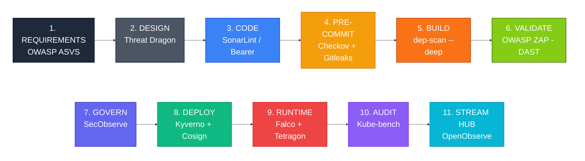
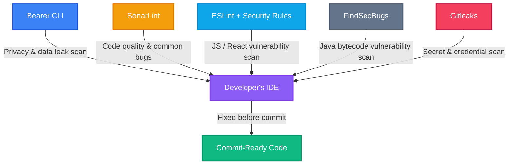
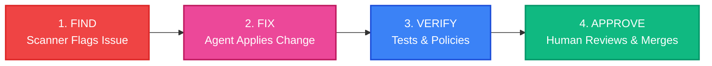

# **The Developer's Guide to DevSecOps**

> **Our Main Goal:** We are building a secure, automated pipeline for our on-premise Kubernetes data platform. It costs zero dollars in licensing fees and follows industry gold standards like NIST, OWASP, and CIS.

---

## **1. Team Rules & Security Culture (NIST SSDF)**

Great tools don't matter if we don't have the right habits. This pipeline is built around the **NIST Secure Software Development Framework (SSDF)**, which focuses on four key areas: preparing our team, protecting our code, producing secure software, and responding to vulnerabilities.

To make this work, we all need to follow a few basic ground rules:

* **Security Training:** Every engineer must complete an annual secure coding training (like the OWASP Top 10) before getting CI/CD pipeline access.
* **Lock Every Account:** MFA is mandatory on every SCM (GitHub/GitLab) account. Stolen or reused passwords are still the #1 way real breaches start, and this one setting blocks most of them before any tool below ever gets a chance to fire.
* **Don't Skip the Gates:** Bypassing automated checks (like Checkov, Gitleaks, or Kyverno) is strictly forbidden unless you have a documented exception signed by a Security Lead.
* **Treat Security Rules Like Code:** If you want to change a security rule (like a Kyverno policy or Falco alert), it goes through the exact same Pull Request (PR) process as application code. It requires two reviewers and a signed commit.
* **Make It Safe to Report Bugs:** We publish exactly how to reach us privately — SECURITY.md in every repo, security.txt on every live app — so a researcher who finds an issue tells us quietly instead of posting it publicly.
* **Security Champions:** Each service has a designated security champion who:
  * Reviews security-related PRs.
  * Maintains threat models and ASVS checklists.
  * Acts as the first escalation point for security questions.
* **Exception-Management Template:** Every documented exception must include:
  * A clear description.
  * Mitigations in place.
  * A time-bound expiry (e.g., 30 days).
  * An automatic SecObserve ticket.
* **Annual Tabletop Exercise:** Once per year, run a simulated incident (e.g., leaked secret, CVE exploit) and:
  * Validate SecObserve workflows.
  * Verify MFA, backup restore, and Falco alerting.
  * Log lessons learned.

---

## **2. The Game Plan: "Shift Left"**

Our core strategy is simple: **catch bugs early**. Instead of waiting for a security audit right before launch, our tools check for issues while you're designing, coding, and building.

We use free, community-driven tools and invest our time in setting them up well, rather than paying for expensive commercial software. We base our cluster rules on the **OWASP Kubernetes Security Testing Guide** and our app rules on the **OWASP ASVS**.



### **The Lifecycle, Step-by-Step**

| **Phase** | **Tool** | **What it Does** | **Why it Matters** |
| --- | --- | --- | --- |
| **1. Requirements** | OWASP ASVS | Creates security checklists. | Sets clear security goals before we even write code. |
| **2. Design** | Threat Dragon | Helps us map out potential threats. | Flushes out bad architectural ideas early. |
| **3. Code** | SonarLint & Bearer CLI | Scans your code right in your IDE. | Acts like a spellchecker for bugs and data leaks. |
| **4. Pre-Commit** | Checkov + Gitleaks | Checks for bad infrastructure configs and accidentally pasted passwords. | Stops silly mistakes before they reach the main codebase. |
| **5. Build** | OWASP dep-scan (`--deep`) | Scans our app libraries AND the container's operating system. | Gives us a single report of all the ingredients we use and any known vulnerabilities. |
| **6. Validate** | OWASP ZAP | Tests the running app in staging (Dynamic Testing). | Catches things code-scanners miss, like broken login flows. |
| **7. Govern** | SecObserve | A central dashboard for all static security alerts. | Keeps build-time and dependency bugs organized so they actually get fixed. |
| **8. Deploy** | Kyverno + Cosign | Checks our Kubernetes setup and verifies image signatures. | Acts as a bouncer, rejecting deployment manifests that break our cluster security rules. |
| **9. Runtime** | **Falco + Tetragon** | Watches system call paths and actively enforces kernel boundaries. | **Falco** handles broad macro-behavior alerts; **Tetragon** provides our final line of defense by forcefully killing malicious process threads in the kernel. |
| **10. Audit** | Kube-bench | Checks our Kubernetes settings against CIS standards. | Makes sure our core platform architecture is locked down tight. |
| **11. Stream Hub** | **OpenObserve** | Consolidated, low-resource database for logs and metrics. | Collects live streams from FluentBit and OTel collectors into cheap Parquet storage using 10x less RAM than traditional setups. |

### **Pipeline Controls**

**SBOM Generation:** Every CI build must generate a CycloneDX or SPDX SBOM artifact, stored alongside the image.

**Branch-Protection Rules:** Use Terraform or similar to codify:
*  Requires signed commits.
*  Requires 2 approvals.
*  Requires a match between CODEOWNERS.
*  Blocks force-pushes and deletion of protected branches.

**Pre-Commit Hooks:** Pre-commit hooks are mandatory and enforced via:
*  A shared `.pre-commit-config.yaml` in the repo.
*  CI validating that hooks ran (e.g., `pre-commit run --all-files`).

---

## **3. Starting Safe: Secure Container Images**

Standard container images (like the ones you pull by default from public hubs) are bloated with extra tools like `curl` or `bash`. Hackers love these tools. We use stripped-down images instead:

* **dhi.io (Free Tier):** Our standard choice for most apps. It has no shells or package managers, and it updates automatically every week.
* **gcr.io/distroless:** Used for compiled languages like Go or Rust that just need bare minimum libraries.

### **Image Comparison Matrix**

| **Feature** | **Standard Public Images** | **Our Standard (dhi.io Free Tier)** | **Future Upgrade (dhi.io Enterprise)** |
| --- | --- | --- | --- |
| **Updates** | Occasional / quarterly | Weekly automated cycles | Daily / on-demand |
| **Vulnerability Footprint** | Vulnerable between releases | Near-zero CVEs | Near-zero + SLAs |
| **Hacker Friendly?** | Highly (ships with `sh`, `apt`, etc.) | Zero (no shell, no utilities) | Zero + FIPS crypto |

### **Proving Our Images are Ours (Signing)**

We don't just trust images; we verify them.

1. **Build:** Cosign digitally signs every image we make.
2. **Deploy:** Kyverno checks the signature. No signature? The code doesn't deploy.
3. **Keys:** We store our signing keys safely in HashiCorp Vault.

### **Additional Image Controls**

* **Pinned Digests:** All image references in manifests must use a digest, not a tag:
  * `image: dhi.io/app@sha256:...`
  * CI fails if a tag is used instead.
* **Base-Image Update Automation:** Automated weekly PRs update base images (dhi.io/distroless) using Renovate or Dependabot.
* **Cosign Key Rotation:** Cosign keys are rotated annually; old keys are revoked in Kyverno policy.

---

## **4. Developer Tools (Catching Bugs Before Commit)**

The cheapest time to fix a bug is while you're writing the code. We have two layers of protection:

1. **On your laptop:** Fast tools that warn you instantly. You can bypass them locally if you're testing, but they exist to save you a headache later.
2. **In CI/CD:** The unskippable automated gate. If the CI/CD pipeline finds a hardcoded password or a critical flaw, it *will* block the merge.

**Repo Rules:** You need signed commits (so we know who wrote the code), a CODEOWNERS file so the right reviewer gets pulled in automatically, a shared .gitignore baseline so secrets and build junk never get committed in the first place, and a second reviewer to approve your PR.



### **What These Tools Do For You**

| **Tool** | **What It Catches** | **Where It Runs** |
| --- | --- | --- |
| **Gitleaks** | Accidentally pasted API keys and passwords. | Pre-commit on your laptop, and again in CI. |
| **Bearer CLI** | Personal user data (PII) leaking into logs. | On your laptop. |
| **SonarLint** | Common bugs and bad code patterns. | Right in your code editor. |
| **ESLint** | Security bugs specific to JavaScript/React. | IDE and build phase. |
| **FindSecBugs** | Security bugs specific to compiled Java code. | IDE and build phase. |

### **Developer Environment Controls**

* **IDE Config-as-Code:** Share IDE security configs (SonarLint, ESLint rules) as code in `.vscode/` or `.idea/` directories.
* **Secret-Detection in CI as Mandatory:** CI fails if Gitleaks finds secrets; remediation requires:
  * Rotating the secret.
  * Adding it to Vault.
  * Updating the code.

---

## **5. Our Security Toolkit & Where Everything Lives**

Here's how our tools map out across the work environment:

* **Planning Zone:** We use OWASP ASVS and Threat Dragon to figure out what needs to be secured before we start typing.
* **Workstation Zone (Your Laptop):** SonarLint, Bearer CLI, and Gitleaks keep your local environment safe.
* **Pipeline Zone (CI/CD):** Checkov scans our Terraform/Helm files, Gitleaks double-checks for passwords, and OWASP dep-scan (`--deep`) checks our libraries and base image operating system for known flaws.
* **Staging Zone:** OWASP ZAP attacks our staging app to find runtime holes.
* **Edge Zone (Ingress / Load Balancer):** Before traffic ever reaches the cluster, we enforce HTTPS redirect, HSTS, CSP, and TLS 1.3 here, and publish security.txt so anyone who finds a live issue knows how to reach us. This is baseline config, not a scan — set once per app, and it closes the exact holes ZAP would otherwise keep flagging in Staging.
* **Management Hubs:**
* **SecObserve (Static Vulnerability Hub):** Acts as our central portal for point-in-time security scans, container vulnerability databases, and build-time compliance scores.
* **OpenObserve (Live Streaming Telemetry Hub):** A single-binary, Rust-based system that captures and aggregates our high-velocity streaming security logs and time-series metrics into highly compressed storage without requiring heavy database backends.


* **Live Kubernetes Zone:** Kyverno enforces security rules at the admission door. Falco acts as our broad monitoring camera, tracking behavior anomalies across user space. Tetragon hooks directly into the Linux kernel using eBPF to enforce strict, zero-trust runtime boundaries and instantly terminates unauthorized processes before they can reach our data platform storage. Cilium/Calico segments our network.
* **Compliance:** OpenSCAP makes sure the underlying host operating systems are up to code.

*Note: Automation bots might suggest fixes on your PRs, but only human engineers can approve them.*

---

### **Runtime Telemetry Flow**

The runtime environment splits logs and metrics at the source to maximize performance, then routes them into a unified, low-overhead analytics backend:

```text
                  KUBERNETES WORKLOAD ZONE
     ┌──────────────────────────────────────────────────┐
     │       Pod Workloads / Node Linux Kernel          │
     └────────┬────────────────────────────────┬────────┘
              │                                │
  (Live JSON Events & Logs)           (Time-Series Metrics)
              ▼                                ▼
       [ Log Shipper ]             [ OpenObserve Collector ]
  (e.g., Vector, FluentBit)                    │
              │                                │
              └───────────────┬────────────────┘
                              │
                              ▼ (OTLP / HTTP JSON)
     ┌──────────────────────────────────────────────────┐
     │                   OPENOBSERVE                    │
     │           (Single-Binary Rust Engine)            │
     ├──────────────────────────────────────────────────┤
     │  - Columnar Parquet File Engine (MinIO/Local)    │
     │  - Built-In Visual Dashboards (Zero-Grafana)     │
     │  - Real-Time SQL Alert & PromQL Engine           │
     └──────────────────────────────────────────────────┘

```

> **Data Flow Mapping:** A lightweight **Log Shipper** (teams may choose Vector, FluentBit, Promtail, etc.) continuously monitors stdout and system sockets to transport high-velocity security events from Falco and Tetragon. Simultaneously, the **OpenObserve Collector** tracks cluster state configurations and Tetragon metric counters. Both streams converge directly inside OpenObserve, combining logs and metrics into unified security dashboards.

---

### **Infrastructure Controls**

**Network Segmentation Diagram:** Add a simple diagram showing:
* Ingress → DMZ → App tier → Data tier.
* Where Cilium/Calico policies sit.


**Explicit Logging of Policy Decisions:** All Kyverno policy changes, runtime logs from Falco, and kernel termination alerts from Tetragon are securely streamed directly into OpenObserve using your team's chosen log shipper to preserve node memory.

**Policy Review Cadence:** All cluster access rules and kernel tracing policies are reviewed annually for configuration drift against current CIS and ASVS baselines.

---

## **6. Proving It: Audit & Evidence**

It's not enough to say we're secure; we have to prove it to auditors and ourselves. Every tool we use generates evidence, and it all feeds directly into our two centralized management hubs: **SecObserve** (for static, point-in-time build findings) and **OpenObserve** (for live, high-velocity stream analytics).

Here is exactly how each tool proves we are doing our jobs:

### **The Evidence Matrix**

| **Tool** | **What it Protects** | **The Proof it Creates (Evidence)** | **Where It Lives** |
| --- | --- | --- | --- |
| **OWASP ASVS & Threat Dragon** | Planning & Design | Security checklists and threat models tracked as project tickets before coding begins. | Project Management Board |
| **SonarLint, Bearer CLI, ESLint, FindSecBugs** | Local Code Safety | Local scan histories proving that bugs and data leaks were fixed *before* the code was committed. | SCM / Pull Request Logs |
| **Kube-bench, Checkov, OpenSCAP** | Configuration & Compliance | Audit-ready reports proving our app configs, Kubernetes settings, and Host OS align with industry standards. | **SecObserve** |
| **Gitleaks** | Secrets | Pipeline logs and remediation records proving any exposed keys were caught and rotated. | **SecObserve** |
| **OWASP dep-scan (`--deep`)** | Supply Chain | Software Bill of Materials (SBOMs) and vulnerability reports for both our app libraries and the base operating system. | **SecObserve** |
| **OWASP ZAP** | Staging / Dynamic Testing | Baseline scan reports proving our live application was attacked and tested before going to production. | **SecObserve** |
| **Kyverno + Cosign** | Deployment Policies | Logs of rejected deployments (e.g., stopping a container that runs as root or lacks a verified Cosign signature). | **OpenObserve** |
| **Falco + Falcosidekick** | Live Environment | Real-time behavior anomalies and runtime threat alerts routed straight to incident response channels. | **OpenObserve** |
| **Tetragon** | Kernel & Process Integrity | Incorruptible execution lineage paths, namespace modification logs, and audit trails of kernel-enforced process terminations (`SIGKILL`). | **OpenObserve** |
| **Velero & etcd Snapshots** | Disaster Recovery | Logs of successful "restore drills" logged into our compliance tracking as Proof of Protection (an untested backup doesn't count as proof). | **SecObserve** |

**SecObserve** is locked down to protect this static evidence. Most of the team can update a finding, but only a couple of trusted leads can delete one — so **no one can quietly make a finding disappear**. Every change needs a short written reason, saved automatically next to the finding, and for sensitive cases we can require a second person to sign off, just like our code reviews.

The live security telemetry flowing into **OpenObserve** is handled with similar rigor. Because OpenObserve stores logs and metrics in compressed, append-only files on secure storage, these operational security records cannot be altered or deleted by application teams, providing an unalterable trail for forensic audits.

---

### **Evidence Management**

* **Automated Evidence Collection:** CI/CD automatically attaches the following to each release artifact in **SecObserve**:
  * SBOM.
  * dep-scan report.
  * Checkov report.
  * Gitleaks report.
  * ZAP baseline scan.


* **Retention Policy:** Both **SecObserve** and **OpenObserve** retain data according to severity requirements:
  * Critical findings & Kernel security logs: 7 years.
  * High/Medium alerts: 2 years.
  * Low/Informational: 1 year.


* **Read-Only Auditor Role:** External auditors are provisioned with dedicated, read-only access to SecObserve dashboards and OpenObserve SQL query consoles with zero modify or delete permissions.

---

### **Our Immediate Action Plan**

Even with these tools, we have a few gaps to close. Here is the roadmap for the platform:

| **Risk** | **The Gap** | **How We're Fixing It** |
| --- | --- | --- |
| 🔴 **Critical** | Secrets stored in plain text. | Rolling out HashiCorp Vault. |
| 🔴 **Critical** | Unverified container images. | Enforcing Cosign image signing + Kyverno verification. |
| 🔴 **Critical** | Flat network (easy for hackers to spread). | Rolling out Cilium/Calico Network Policies to contain breaches. |
| 🔴 **Critical** | Attackers can run arbitrary commands if an application container is compromised. | Deploying **Tetragon TracingPolicies** to instantly `SIGKILL` unapproved binary executions or namespace changes. |
| 🟠 **High** | SecObserve needs a backup plan. | Implementing nightly DB backups and tested restore drills. |
| 🟡 **Medium** | Logging environments consume excessive memory and storage space on our local nodes. | Discarding traditional Java-based ELK and Loki architectures. Deploying **OpenObserve** as a unified telemetry backend to combine security logs and metrics using our chosen **Log Shipper**. |

---

### **Resilience Controls**

* **Backup Test Automation:** Quarterly restore tests are:
  * Automated via scripts.
  * Logged in SecObserve with pass/fail status.


* **RPO/RSL Definitions:** Define Recovery Point Objective (RPO) and Recovery Service Level (RSL) per workload:
  * Critical Data Components: RPO < 15 minutes, RSL < 4 hours.
  * Non-critical Platform services: RPO < 24 hours, RSL < 24 hours.

---

## **7. Bouncing Back (Resilience)**

Disaster recovery is a core part of security. Even with every prevention tool in this guide running, things can still go wrong — a bad deploy, a hardware failure, or a real attack. When that happens, the only thing that matters is whether we can get back the data and systems we lost. Here's what we back up, how often, and — just as important — how we actually prove each backup works before we ever need it for real.

| **What** | **Tool** | **How Often** | **How We Prove It Works** |
| --- | --- | --- | --- |
| **Cluster State (etcd)** — the master record of everything running in Kubernetes | Native etcd snapshotting | Daily, stored away from the cluster itself | Every three months, we restore it onto a separate test cluster to confirm it actually works |
| **App Volumes** — the files and storage our applications use | Velero | Daily | Same quarterly restore test, on the same test cluster |
| **Application Data (Databases)** — the actual records our apps create, like customer or transaction data | Native database backup tools (e.g. `pg_basebackup` for Postgres) | Continuous, plus one full backup daily | Every three months, we restore the database to a specific point in time and confirm the data is correct |
| **SecObserve (our security record-keeping)** | Database export to storage outside the cluster | Nightly | See Chapter 6 — restore tests are logged back into SecObserve itself as proof |
| **Network Containment** — stopping an attacker from spreading if they get in | Cilium/Calico Network Policies | Always running | We review network traffic logs after any real incident to confirm the containment held |

**One rule applies to everything above:** our backups are stored somewhere that even our own cluster administrators can't delete or change. If an attacker — or a member of our own team, by mistake — gets full admin access to the cluster, they should still not be able to touch yesterday's backup. That's the difference between a bad day and a permanent loss.

In practice, this means turning on a setting called **WORM (Write Once, Read Many)**, sometimes labeled "object lock," on whatever storage holds the backups. Once switched on for a file, this setting makes it physically impossible for anyone — including someone with full admin rights — to delete or overwrite it until a set time period has passed. It's enforced by the storage system itself, not by Kubernetes permissions, which is exactly why it still protects us even if our Kubernetes access is fully compromised.

### **Resilience Controls**

* **Backup Test Automation:** Quarterly restore tests are:
  * Automated via scripts.
  * Logged in SecObserve with pass/fail status.
* **RPO/RSL Definitions:** Define Recovery Point Objective (RPO) and Recovery Service Level (RSL) per workload:
  * Critical: RPO < 15 minutes, RSL < 4 hours.
  * Non-critical: RPO < 24 hours, RSL < 24 hours.

---

## **8. AI Assistants (Helping, Not Taking Over)**

We use AI agents to help us move faster, but **humans are always in control of the big decisions**. 

This section is the floor, not the ceiling. We anchor it to the **OWASP Top 10 for Agentic Applications (ASI Top 10)** — the OWASP framework for autonomous-agent risk — and its two guiding ideas: **Least-Agency** (give an agent only the autonomy a task actually needs) and **Strong Observability** (always know what it did, why, and under which identity). What follows is enough to start applying agents safely; as our usage grows, it's on the team to keep building on these foundations.

### **The Agent Responsibility Model**

| **Stage** | **Agent Security Role** | **Human Security Role** | **Guardrail** |
| --- | --- | --- | --- |
| **Plan** | Draft security requirements and threat-model checklists. | Approve scope and risk ratings. | Agents cannot accept risk or change severity. |
| **Design** | Suggest security patterns and mitigations. | Own data flows and trust boundaries. | Agents cannot approve architecture or reclassify data. |
| **Code** | Propose secure refactors and fixes for findings in branches. | Own intent and merge decisions. | Agents never push to protected branches or mark checks as passed. |
| **Test / Review** | Generate candidate security tests and first-pass PR comments. | Curate tests and perform final review. | Agents cannot merge tests or PRs; human approval is required. |
| **Deploy** | Enrich deploy checks with risk context. | Decide rollout and rollback. | Agents cannot trigger deploys or rollbacks. |
| **Runtime / Operate** | Correlate alerts and draft runbook steps. | Own incident severity, RCA, and containment. | Agents cannot close incidents or change on-call routing. |
| **Maintain** | Open PRs for low-risk dependency and policy updates. | Approve changes for critical systems. | Auto-fix limited to well-tested repos; humans approve merges. |

Agents are **never** allowed to initiate design changes, alter deployment pipelines, perform incident RCA, or trigger production deploys or rollbacks — those stay human-only, as defined in the Agent Responsibility Model above.

### **Working With Agents Day to Day**

* When tools like Bearer or SonarLint flag an issue, the agent explains it in context and suggests remediation options.
* The agent drafts candidate fixes and targeted tests; humans review, edit, and decide what actually lands in the branch.
* Security-rule changes the agent drafts (Kyverno, Falco, Checkov) still go through the **same two-reviewer, signed-commit process** as any other security rule change (Chapter 1). Agent-authored is not a shortcut.

### **The Autonomous Loop (Low-Blast-Radius Work)**

For background maintenance, a constrained agent loop can handle routine tasks on its own:



This loop is limited to low-blast-radius tasks: dependency bumps and static-analysis-driven refactors are good fits. Policy synthesis (below) can use this loop too, but because a wrong policy can fail *silently* — blocking good deploys, or worse, leaving a quiet gap — it never skips the two-reviewer rule above.

### **Where Agents Plug Into the Pipeline**

| **Pillar** | **What It Does** | **On-Premise Implementation** |
| --- | --- | --- |
| **Reachability Triage** | Decides whether a CVE that dep-scan found is actually reachable in our code, and produces a VEX verdict. | Agent walks the call graph, checks compatibility, updates the dependency, re-runs tests, and opens a PR with the VEX result attached. |
| **Policy Synthesis** | Turns plain-text NIST/CIS rules into Kyverno or Checkov policy. | Agent drafts validated YAML, links it to test cases, and proposes it via PR — held to the two-reviewer rule above. |
| **Alert Correlation** | Groups related Falco alerts into one picture and drafts a first-pass runbook. | Agent clusters alerts by host/workload and attaches relevant logs, giving the on-call engineer a starting point — it never closes the incident. |

### **Agent Controls**

* **Agent Identity and Audit Trail:** All agent actions:
  * Use a dedicated service account.
  * Are logged with a `service=ai-agent` label.
  * Require human approval for any production change.
* **Agent-Generated Code Review Checklist:** Agents generate a lightweight checklist per PR:
  * Secrets scanned.
  * CVEs triaged.
  * Policy changes reviewed.
  * Humans check off before merge.

---

Here is the fully revised and integrated **Chapter 9** for your DevSecOps guide.

The timeline has been reorganized logically to account for the new architecture, ensuring you build your security posture from foundational team requirements up to advanced kernel-level enforcement and unified observability.

---

## **9. Step-by-Step Implementation Checklist**

Our implementation strategy is broken into progressive milestones to ensure platform stability while incrementally shifting our security left and locking down live runtime environments.

### **Phase 1: Foundations & Code Security Gatekeeping**

* [ ] **Org-Wide MFA Implementation:** Enforce mandatory multi-factor authentication across all Source Control Management (GitHub/GitLab) accounts.
* [ ] **Branch Protection Engineering:** Codify repository protection rules requiring signed commits, two authorized peer reviews, and strict alignment with a `CODEOWNERS` validation file.
* [ ] **Local Security Tooling:** Mandate local laptop installations of SonarLint, Bearer CLI, and Gitleaks. Configure a shared `.gitignore` baseline repository policy.
* [ ] **Pre-Commit Enforcement:** Distribute a shared `.pre-commit-config.yaml` layout and verify in CI that hooks ran on all files prior to code integration.
* [ ] **Vulnerability Management Engine:** Spin up **SecObserve** as our centralized static reporting hub to store point-in-time scanning metadata.

### **Phase 2: CI/CD Guardrails & Software Supply Chain**

* [ ] **Pipeline Manifest Scanning:** Integrate Checkov and Gitleaks into the unskippable CI validation loops to reject hardcoded credentials or misconfigured IaC.
* [ ] **Dependency Triage Setup:** Establish OWASP dep-scan (`--deep`) within build pipelines to capture vulnerabilities inside application libraries and underlying base operating systems.
* [ ] **Software Bill of Materials (SBOM):** Force the automated generation of CycloneDX or SPDX SBOM artifacts for every successful production build.
* [ ] **Dynamic Application Testing:** Deploy OWASP ZAP within the staging zone to automate baseline external web application vulnerability testing on every deploy.

### **Phase 3: Core Platform Ingress & Cluster Admission**

* [ ] **Edge Hardening:** Configure the ingress/load balancer tier to enforce strict HTTPS redirection, HSTS headers, Content Security Policies (CSP), and TLS 1.3 protocol requirements.
* [ ] **Security Vulnerability Disclosure:** Publish a standardized `SECURITY.md` file across all code repositories and set up a public-facing `security.txt` configuration on active web properties.
* [ ] **Admission Control Engine:** Deploy Kyverno to act as the primary cluster bouncer, validating incoming manifests and rejecting non-compliant workloads before execution.
* [ ] **Network Micro-Segmentation:** Introduce Cilium or Calico network policies to transition the cluster away from a flat internal network layer into isolated application and data tiers.

### **Phase 4: Unified Observability Infrastructure**

* [ ] **Log Optimization Engine:** Deploy **OpenObserve** using its official Kubernetes Helm chart, configuring it to save data onto compressed, append-only local block directories or a secure on-premise MinIO bucket.
* [ ] **Platform Metric Scraping:** Spin up the embedded OpenObserve Collector DaemonSet across the cluster to map core hardware usage and `kube-state-metrics` natively via PromQL channels.
* [ ] **Cluster Logging Architecture:** Deploy your team's chosen, lightweight **Log Shipper** framework (e.g., Vector, FluentBit, or Promtail) to scrape node container runtimes and send standard log output formatting directly to OpenObserve endpoints.

### **Phase 5: Runtime Shielding & Kernel Enforcement**

* [ ] **Behavioral Auditing Platform:** Deploy Falco paired with Falcosidekick to continuously evaluate user-space system call anomalies and route immediate webhook warning alerts straight to team messaging apps.
* [ ] **Kernel Security Engine:** Deploy **Tetragon** across all nodes to intercept runtime exploit workflows at the lowest operating system execution layer.
* [ ] **Tetragon Profiling Baseline:** Run Tetragon in active **Audit Mode** for a minimum of 7 days to baseline valid production data platform behaviors without applying rigid block constraints.
* [ ] **Active Containment Enforcement:** Apply targeted Tetragon `TracingPolicy` definitions to critical application namespaces, converting the engine into active **Enforcement Mode** to forcefully issue a `SIGKILL` termination to any unauthorized background script executions or hostile namespace alterations.

### **Phase 6: Image Provenance & Platform Hardening**

* [ ] **Secrets Lifecycle Automation:** Roll out HashiCorp Vault inside the environment and remove any remaining plain-text configurations from static manifests.
* [ ] **Image Trust Framework:** Establish Cosign image signing pipelines inside our container builds and enforce key validation directly at the Kyverno admission ring.
* [ ] **Immutable Base Layers:** Migrate core container workloads over to secure, stripped-down base configurations using zero-utility alternatives like `dhi.io` or Google Distroless options.
* [ ] **Host Compliance Auditing:** Deploy OpenSCAP across physical node hosting structures to measure server baseline configuration drift against benchmark industry hardening standards.

### **Phase 7: Disaster Resilience & Autonomous Operations**

* [ ] **Disaster Recovery Pipelines:** Configure daily automated snapshots for cluster states (`etcd`), application storage volumes via Velero, and core databases using native point-in-time utilities.
* [ ] **Immutable Storage Controls:** Enable Write-Once, Read-Many (**WORM**) object locking on back-end storage servers to insulate backups from malicious administrative deletion.
* [ ] **Disaster Drill Verification:** Execute automated quarterly test-restores onto completely separate sandbox clusters, automatically recording pass/fail states directly back into SecObserve metrics.
* [ ] **Agentic AI Assistance Integration:** Connect approved local LLM interfaces to automate code-reachability triage tasks, auto-generate standard policy manifests, and map initial alert correlation patterns using secure service account tokens.
---

## **10. Cheat Sheet (Acronyms)**

| Term | What it Means | Context in our Pipeline |
| --- | --- | --- |
| **API** | Application Programming Interface | Where Kyverno intercepts code heading into Kubernetes. |
| **ASVS** | Application Security Verification Standard | Our security checklist for planning. |
| **CI/CD** | Continuous Integration / Deployment | Our automated build/test pipeline. |
| **CIS** | Center for Internet Security | The group that writes the rules Kube-bench checks for. |
| **CSP** | Content Security Policy | An ingress/edge rule that blocks malicious scripts from loading in the browser. |
| **CVE** | Common Vulnerabilities and Exposures | A public list of known hacker exploits. |
| **DAST** | Dynamic Application Security Testing | Attacking a live staging app (done by ZAP). |
| **HSTS** | HTTP Strict Transport Security | An ingress/edge rule forcing browsers to always use HTTPS for our apps. |
| **IaC** | Infrastructure as Code | Config files (Helm/Terraform) scanned by Checkov. |
| **LLM** | Large Language Model | The local AI brains powering our SRE assistants. |
| **MFA** | Multi-Factor Authentication | Required on every SCM (GitHub/GitLab) account. |
| **PR** | Pull Request | The gate where humans approve code and security changes. |
| **RBAC** | Role-Based Access Control | Decides who has admin powers in the cluster. |
| **RPO** | Recovery Point Objective | How much data loss is acceptable in a disaster. |
| **RSL** | Recovery Service Level | How quickly services must be restored after a disaster. |
| **SAST** | Static Application Security Testing | Scanners looking at raw code without running it. |
| **SCA** | Software Composition Analysis | Checking our third-party libraries for flaws. |
| **SBOM** | Software Bill of Materials | The "ingredients list" of our apps. |
| **VEX** | Vulnerability Exploitability eXchange | Tells us if a known bug is *actually* dangerous to us. |
